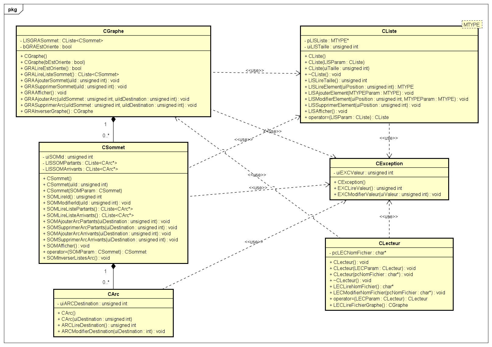

# ProjetTutoreCppS6PolytechToursGraphes

## Présentation
Projet de programmation d'une librairie de classes et de fonctions permettant de manipuler des graphes. Projet réalisé dans le cadre du projet tutoré C++ du sixième semestre du cycle ingénieur de Polytech Tours.

### Contenu
Le projet est composé de 6 éléments :
- **CException** : une classe permettant de gérer les exceptions qui surviennent dans le cadre des situation anormales mais prévisibles de fonctionnement
- **CListe<MTYPE>** : un patron (template) de classe permettant de manipuler des listes contenant des éléments de type quelconque, type quelconque représenté par le type générique MTYPE
- **CLecteur** : une classe permettant de lire un fichier et de le manipuler, en particulier on va l’utiliser pour créer un Graphe orienté à partir d’un fichier donné en paramètre de ligne de commande
- **CGraphe** : une classe permettant de manipuler un graphe
- **CSommet** : une classe permettant de manipuler des sommets dans un graphe
- **CArc** : une classe permettant de manipuler des arcs reliant des sommets dans un graphe

### Diagramme de classes UML


## Manuel de l’utilisateur
### Lancer le programme
Afin de lancer le programme il suffit de placer votre fichier de test en format txt rédigé suivant le modèle suivant dans le même répertoire que l'exécutable :

```
NBSommets=<Nombre_de_Sommets_du_graphe>
NBArcs=<Nombre_d_arcs_du_graphe >
Sommets=[
Numero=<Numéro_sommet >
Numero=<Numéro_sommet>
...
Numero=<Numéro_sommet>
]
Arcs=[
Debut=<Sommet_départ_arc>, Fin=<Sommet_arrivée_arc>
Debut=<Sommet_départ_arc>, Fin=<Sommet_arrivée_arc>
...
Debut=<Sommet_départ_arc>, Fin=<Sommet_arrivée_arc>
]
```

Par exemple :

```
NBSommets=3
NBArcs=3
Sommets=[
Numero=1
Numero=2
Numero=3
]
Arcs=[
Debut=1, Fin=2
Debut=2, Fin=3
Debut=3, Fin=1
]
```

Veillez à respecter le format du fichier :
- NBSommets et NBArcs sont positifs
- Le nombre de sommets et d’arcs doit concorder avec NBSommets et NBArcs

NB : Seuls les graphes orientés sont pris en charge.

Enfin il vous faudra ouvrir un terminal Windows et vous placer dans le répertoire de l’exécutable puis saisir la commande sous la forme suivante :

```
.\<nom de l'exécutable>.exe <nom du fichier>.txt
```

Par exemple :

```
.\PT_CPP_Graphes.exe test.txt
```

Il est impératif de spécifier un seul et unique nom de fichier.

### Liste des codes erreurs
Notez que dans le cas où un code erreur serait indiqué sans précision, vous pouvez vous référer au tableau récapitulatif suivant :

NB : Les codes erreurs sont définis par rapport à la classe dans laquelle ils se trouvent par le chiffre des dizaines (ex: 2x : CLecteur)

| Code | Nom | Classe |
| - | - | - |
| 1 | PasDeFichierEnArgument | Fonction main |
| 2 | TropDArguments | Fonction main |
| 11 | ListeVide | CListe |
| 12 | DepassementdeTaille | CListe |
| 21 | NomFichierManquant | CLecteur |
| 22 | EchecOuvertureFichier | CLecteur |
| 23 | FormatFichierInvalide | CLecteur |
| 31 | EstDejaDansLaListe | CSommet |
| 32 | NEstPasDansLaListe | CSommet |

### Qu’est-ce qu’un graphe et comment le manipuler ?
Un graphe (CGraphe) est composé de sommets (CSommet) reliés par des arcs (CArc).

Un graphe peut être orienté, c’est à dire que les arcs reliant les sommets ne peuvent être parcourus que dans un sens défini.
Ou il peut être non orienté, c’est à dire que les arcs reliant les sommets peuvent être parcourus dans n’importe quel sens.

Pour créer un graphe on va d’abord créer un objet CGraphe grâce au constructeur ```CGraphe(bool bEstOriente)``` en spécifiant si le graphe est orienté avec true si tel est le cas. 
Puis on va ajouter des sommets avec la méthode ```GRAAjouterSommet(unsigned int uiId)``` en spécifiant l’identifiant du sommet à créer. 
Et enfin on va ajouter des arcs au graphe en spécifiant le sommet source et le sommet de destination avec la méthode ```GRAAjouterArc(unsigned int uiIdSommet, unsigned int uiIdDestination)```.

Il est par ailleurs possible de supprimer des sommets ou des arcs, d’afficher un graphe avec ```GRAAfficher()``` ou encore d’inverser le graphe, c’est à dire d’inverser les arcs avec ```GRAInverserGraphe()```.